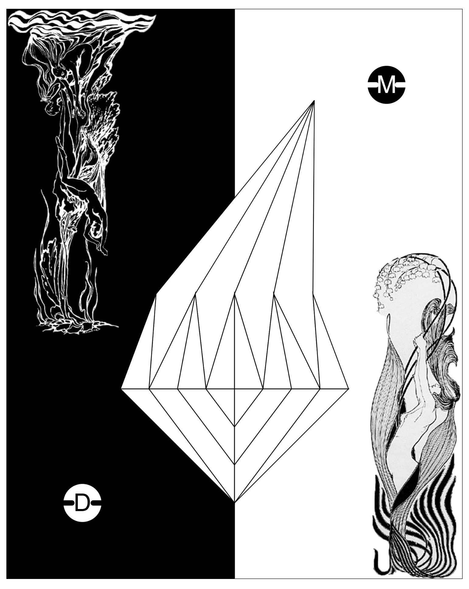
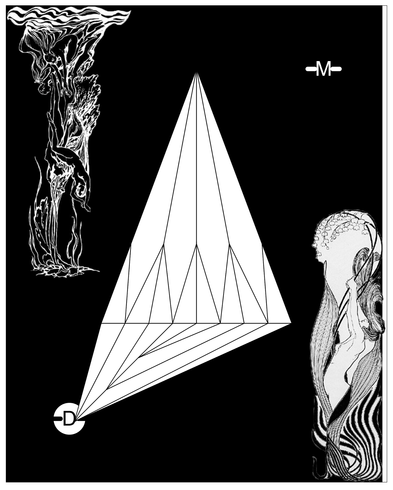
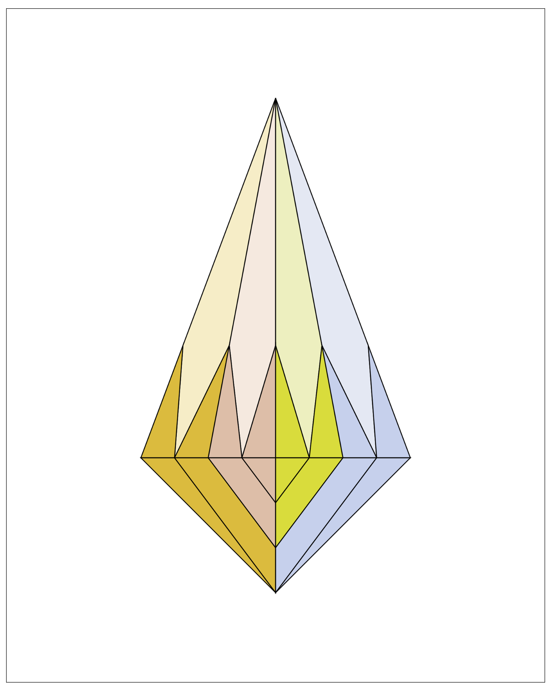

# Bipolar Brilliance an Art Jam

Sophia Andtbacka

[View this project online](https://sophiaandtbacka.github.io/cart253/topics/art%20jam/template-p5-project/)

## Description
 This is an interactive art piece and self-portrait exploring my bipolar disorder.
 
 The user begins on a sterile, clinical start screen where a monotone lecture plays —
 setting a mood of detached malaise.
  
 At the center, a clear white-outlined gem represents the “clinical” simplification
 of a complex inner experience.
  
 The screen splits like a playing card — a black side depicting a drawn figure of depression,
 and a white side showing an uplifted figure of mania.
 
 Moving the cursor over the gem prompts an interaction: pushing the user to take
 either the “depressive pill” or the “manic pill.”
  
 Upon clicking a pill, a medicine bottle rattling sound plays as the scene transitions slowly
 into either the depressive or manic screens.
  
 Each of these states is visualized through the new color grading of the gem facets,
 representing the multiple layers and versions within depressive and manic experiences.
 
## Screenshot(s)

This bit should have some images of the program running so that the reader has a sense of what it looks like. For example:

> 
> 
> 

## Attribution

This bit should attribute any code, assets or other elements used taken from other sources. For example:

> - This project uses [p5.js](https://p5js.org).
> - Audio excerpts sourced and edited from: Dr. Patrick McKeon — Bipolar Disorder (lecture, July 2014).
    YouTube: https://www.youtube.com/watch?v=HByl6pCGEps
> - Sound effect: Pill bottles open, pour out, close louder — sourced from Pixabay
    Licensed under the Pixabay Content License (free for non-commercial use, no attribution required — attribution given voluntarily).
> - Image references both sourced via Pinterest
    Original artists unknown — used for educational and non-commercial purposes as part of an interactive artwork exploring bipolar disorder.
> - used edited version of example code from dog button pippin example for pill button interaction and sound effects

## License

This bit should include the license you want to apply to your work. For example:

> This project is licensed under a Creative Commons Attribution ([CC BY 4.0](https://creativecommons.org/licenses/by/4.0/deed.en)) license with the exception of libraries and other components with their own licenses.