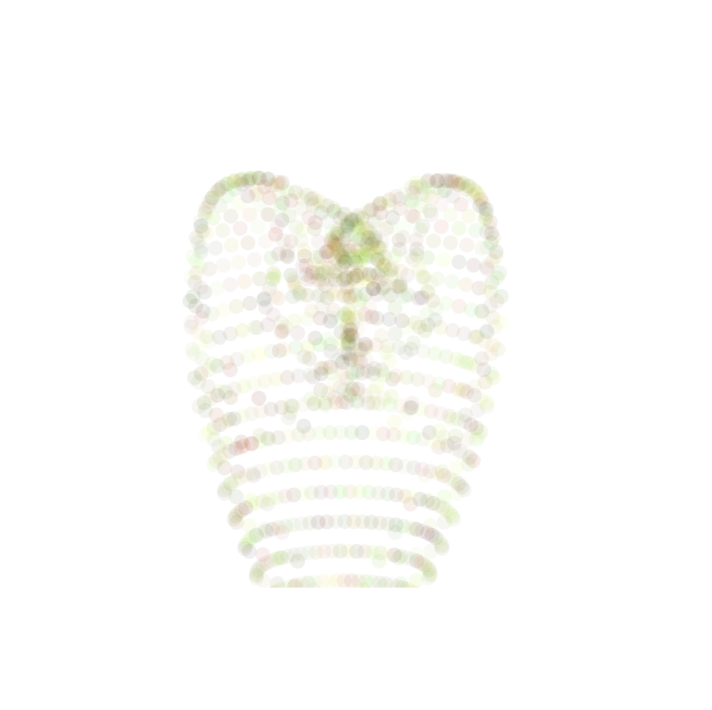
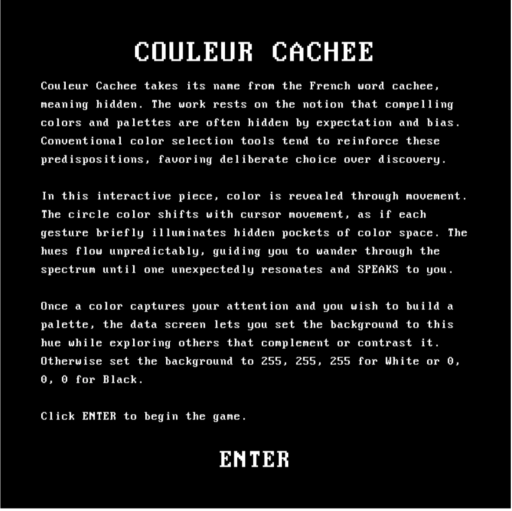
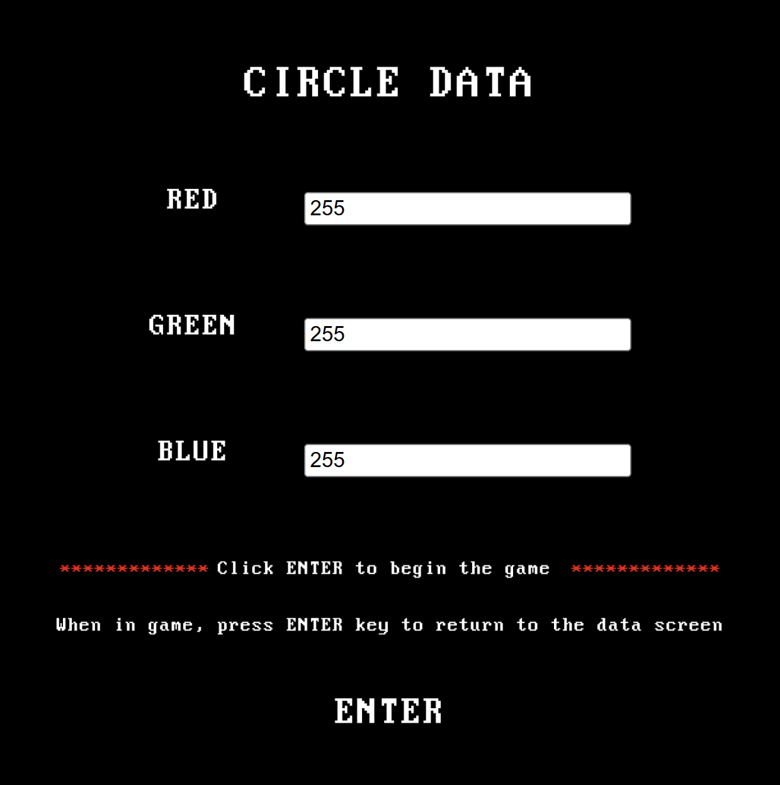
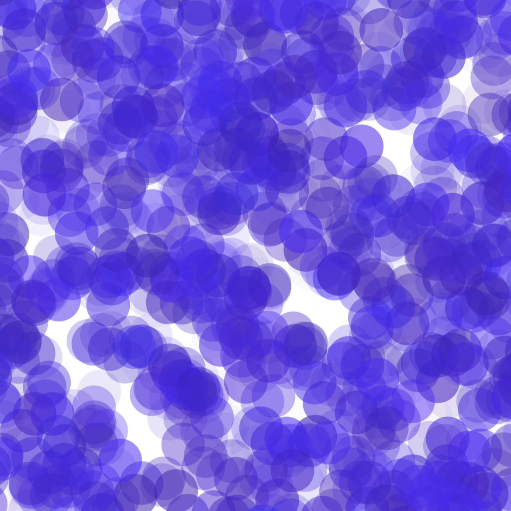

# Digital DADA: Variation Jam

Sophia Andtbacka

[View this project online](https://sophiaandtbacka.github.io/cart253/topics/final%20variation%20jam)

## Project Description

This project draws inspiration from the Dada movement, bringing it into the digital age. Rather than creating traditional games with set objectives, it leans on the philosophy of process art, presenting interactive spaces for exploration and experimentation. At its core, the work begins with a single shape < the circle > and investigates how computation can generate a variety of uniquely digital experiences through this simple visual element.

Through this framework two uniquely digital concepts are explored, randomness and digital movement. Firstly, randomness introduces true unpredictability, allowing each iteration to unfold differently and producing outcomes that cannot be fully anticipated. Secondly, movement in the digital domain. This includes parameters such as acceleration, friction, attraction, and constraints which can be precisely defined, enabling behaviors and patterns that would be impossible to replicate in the physical world. Together, these mechanisms reveal the distinctive capacities of computation in visual creation.

As a result, the role of the participant shifts from that of a player pursuing goals to that of an observer and curator. The project encourages participants to step back and watch patterns and behaviors evolve, intervening only when particular moments resonate.  In this way, creation becomes curation. This act of noticing, choosing, and framing becomes the artistry.

## Variation 1 Description (Swallow Circle)

Swallow Circles explores how simple rules in code can generate unexpected visual forms. The circles begin arranged in a precise pyramid, creating a stable and orderly structure. However, as the mouse moves across the screen, the circles are drawn toward it, drifting from their original positions. Over time they overlap and cluster, producing a black-hole-like swallowing effect that gives the composition a dynamic, evolving quality.

The data screen allows you to adjust the number of circles, their size, and their color ranges, which changes how the circles interact and form new patterns. During the simulation, pressing the UP arrow or W key freezes the circles’ movement, allowing you to pause and study emergent forms that capture your interest, making it easier to take screen grabs. Pressing the DOWN arrow or S key restarts the movement. This interaction between code, movement, and user input creates an experience where initial order transforms unpredictably into new structures.

## Variation 2 Description (Couleur Cachée)

Couleur Cachée takes its name from the French word cachée, meaning hidden. The work rests on the notion that compelling colors and palettes are often hidden by expectation and bias. Conventional color selection tools tend to reinforce these predispositions, favoring deliberate choice over discovery.

In this interactive piece, color is revealed through movement. The circle color shifts with cursor movement, as if each gesture briefly illuminates hidden pockets of color space. The hues flow unpredictably, guiding you to wander through the spectrum until one unexpectedly resonates and SPEAKS to you.

Once a color captures your attention and you wish to build a palette, the data screen lets you set the background to this hue while exploring others that complement or contrast it. Otherwise set the background to 255, 255, 255 for White or 0, 0, 0 for Black.

## Variation 3 Description (Bubble Burster)

Bubble Burster takes its name from the simple act of blowing bubbles and watching children try to burst them, a playful and seemingly random process.
A field of circles appears, shaped by the ranges you set, including the number of circles and the span of possible color values. When a circle seems off, clicking it will send it to a new location with a fresh color, allowing the image to evolve through repeated bursts of change.
Through repeated interaction and chance, unexpected patterns emerge. The final image is not directed or predetermined but arises through exploration, attention, and play.

## Screenshot(s)

This bit should have some images of the program running so that the reader has a sense of what it looks like. For example:

> 

> 

> 
(./assets/images/swallowCircle2.png)
(./assets/images/swallowCircle3.png)
(./assets/images/swallowCircle4.png)

> 

> 

> 
(./assets/images/couleurCacheeGame2.png)

> 
(./assets/images/bubbleBuster2.png)

## Attribution

Attribution:

> - This project uses [p5.js](https://p5js.org).
> - Menu uses code from Pippin's Rotating Around a Circle (https://editor.p5js.org/pippinbarr/sketches/vHseqXxOh)
> - Variation 1 uses code from Pippin's Acceleration and Friction (https://editor.p5js.org/pippinbarr/sketches/HO_uPhbAD)

## License

This bit should include the license you want to apply to your work. For example:

> This project is licensed under a Creative Commons Attribution ([CC BY 4.0](https://creativecommons.org/licenses/by/4.0/deed.en)) license with the exception of libraries and other components with their own licenses.