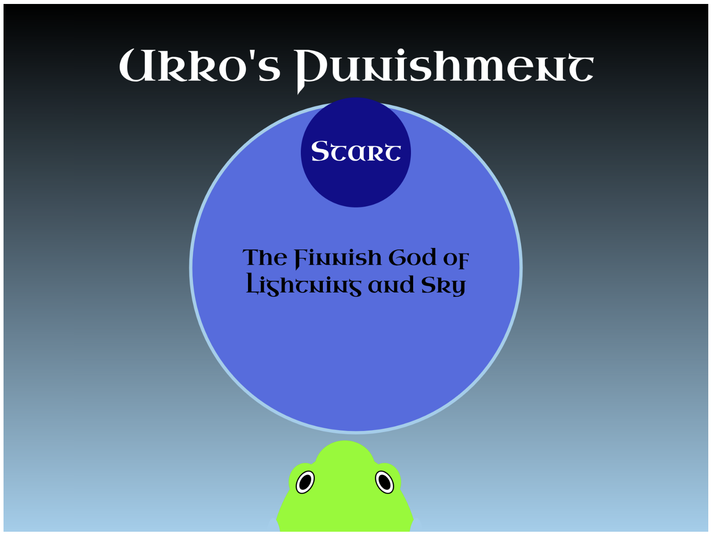
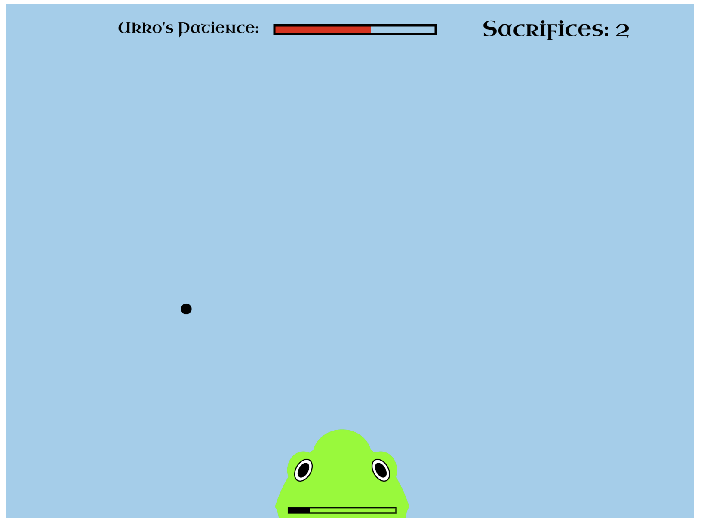
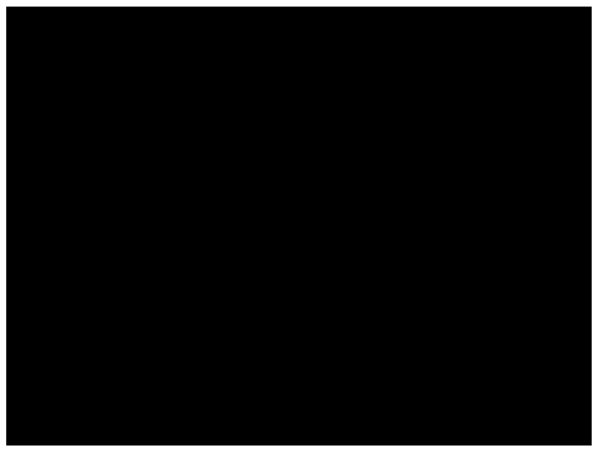
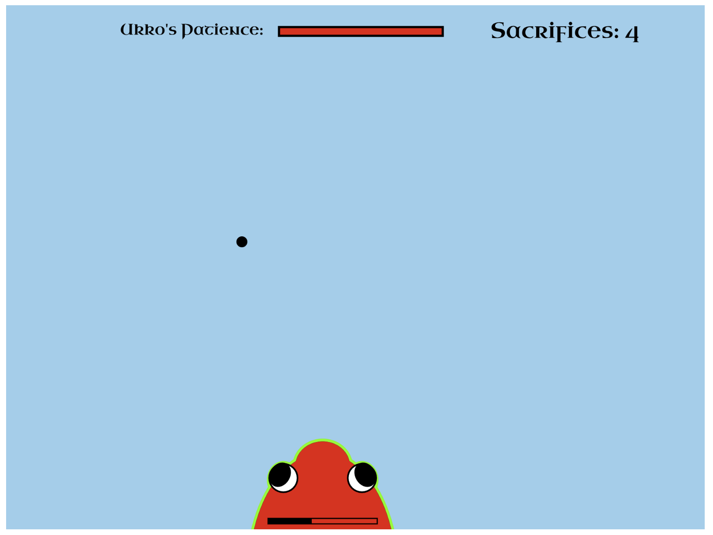
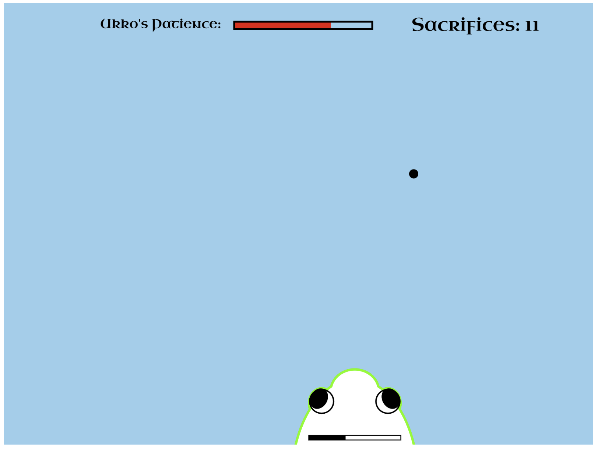
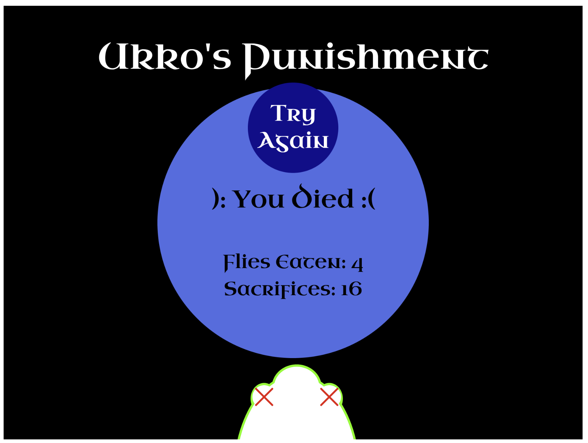

# Ukko's Punishment

Sophia Andtbacka

[View this project online](https://sophiaandtbacka.github.io/cart253/topics/mod%20jam/mod%20jam/)

## Description

Ukko's Punishment is all about regulating gluttuny and staying humble. You are a simple frog make sure you eat enough to stay alive but don't become gluttonous and forget to offer sacrifices to Ukko the god of sky and lightning. If this happens you will face his wrath and get electrocuted. 

To eat launch your tongue at the flies that are moving accross the screen if you touch the fly it wiil be eaten. To offer a sacrifice let the fly fly off the screen. 

#Controls
-Mouse Move: move your mouse around the screen to change the frog's X position
-Mouse Click: click your mouse to launch your tongue and attempt to eat a fly

## Screenshot(s)

This bit should have some images of the program running so that the reader has a sense of what it looks like. For example:

> 
> 
> 
> 
> 
> 

## Attribution

This bit should attribute any code, assets or other elements used taken from other sources. For example:
> - I based my game state code off of Basic States https://editor.p5js.org/pippinbarr/sketches/cpmo2ac1V
> - I based my text box code off of Friends, Romans, Countrymen https://editor.p5js.org/pippinbarr/sketches/wfDOLrIm13
> - I based my text box code off of timed text https://editor.p5js.org/chjno/sketches/ByB2R5r9W

> - This project uses [p5.js](https://p5js.org).
> - The background music is "Ukko" by Atlas from https://www.youtube.com/watch?v=IxoayKPth1Q
> - The lightning sound effect is "Lightning" by SonixFXSounds from freesound.org: https://pixabay.com/sound-effects/lightning-442880/

## License

This bit should include the license you want to apply to your work. For example:

> This project is licensed under a Creative Commons Attribution ([CC BY 4.0](https://creativecommons.org/licenses/by/4.0/deed.en)) license with the exception of libraries and other components with their own licenses.